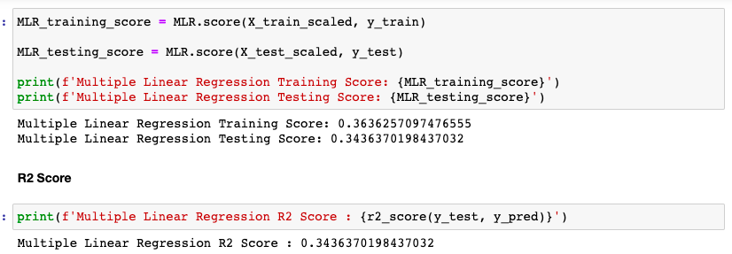
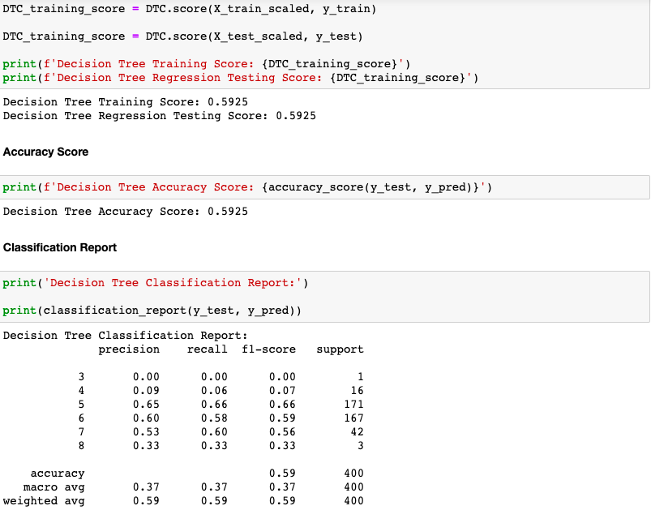
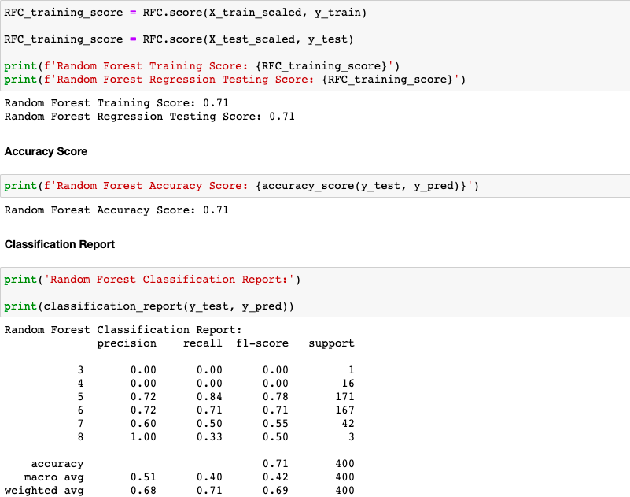
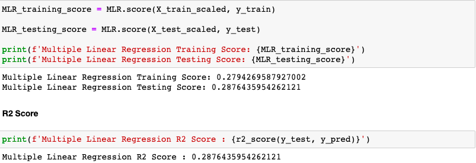
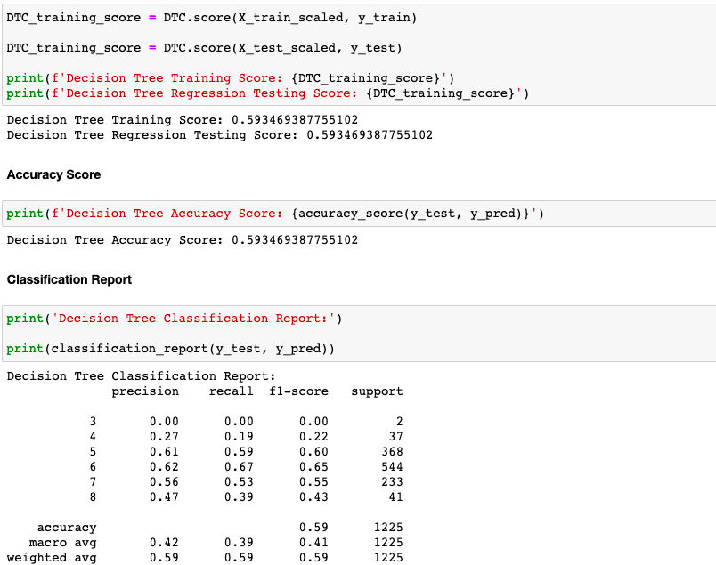
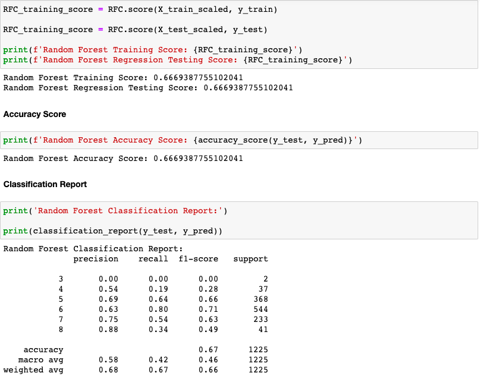

# Wine_Quality_Analysis

## Objective

This project used supervised machine learning models to predict the quality of red and white wines.  I used the following models: Multiple Linear Regression, Decision Tree, and Random Forest.  My goal was to assess which model is best used to predict wine quality and also if the models' accuracy differs between red and white wine.

- Multiple Linear Regression: Tries to predict a dependent variable based on multiple independent variables.

- Decision Tree: Encodes a series of true-or-false questions that we can interpret as if-else statements.  

- Random Forest: Will sample the data and build several smaller, simpler decision trees.  Each tree is considered a “weak classifier,” but when you combine them, they form a “strong classifier".

### Tasks
1. Clean and process the data.
2. Choose target and feature variables.
3. Standardize the features.
4. Split training and testing data.
5. Instantiate the machine learning model.
6. Evaluate the model performance based on classification scores.
7. Calculate the classification accuracy score or R2 Score.

## Resources

### Tools/Languages
- jupyter notebook 6.4.5
- visual studio code 1.67.0
- python
- sci-kit learn

### Sources
- https://archive.ics.uci.edu/ml/datasets/Wine+Quality

## Red Wine Analysis

### Multiple Linear Regression

 

### Decision Tree

 

### Random Forest

 

## White Wine Analysis

### Multiple Linear Regression

 

### Decision Tree

 

### Random Forest

 

## Summary
- The Multiple Linear Regression model for both red and white wines was had the lowest accuracy amongst the 3 learning models.  

- The Random Forest model for both the red and white wines had the highest accuracy amongst the 3 models.

- The Decision Tree model for both the red and white wines had the same accuracy score of 59%.  The other model's scores for both the red and white wines didn't differ much.

- Based on the similar scores for both wine types, I do not believe the wine type matters for predicting wine quality.

- Based on the high precision and accuracy scores of 71% (red wine) and 67% (white wine), I believe the random forest model is the best predictor for wine quality.
